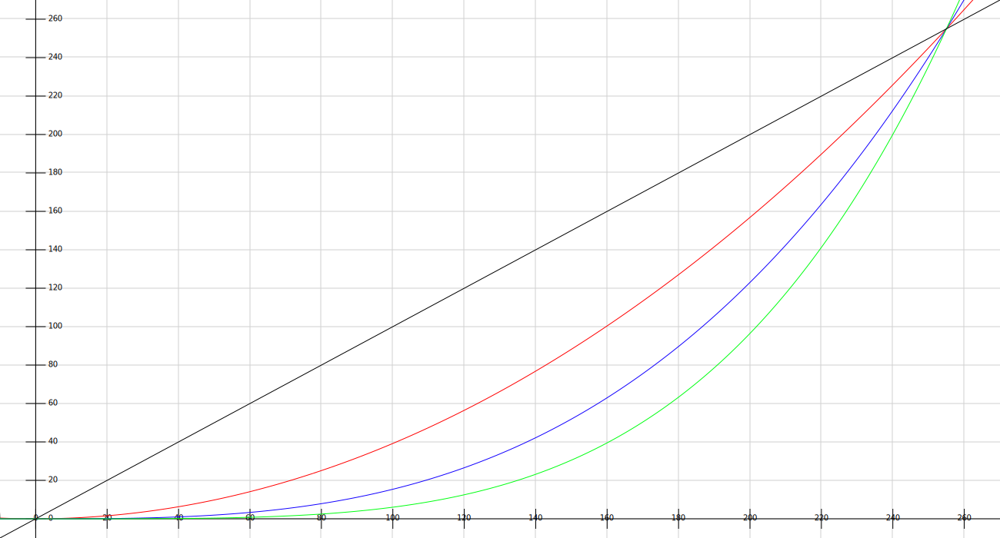

.. py:currentmodule:: pyartnet

######################################
PyArtNet
######################################
pyartnet is a python implementation of the ArtNet protocol using
`asyncio <https://docs.python.org/3/library/asyncio.html>`_.
Supported protocols are ArtNet, sACN and KiNet.

Getting Started
==================================

.. exec_code::

    # hide: start
    from helper import MockedSocket
    MockedSocket().mock()
    # hide: stop

    import asyncio
    from pyartnet import ArtNetNode

    async def main():
        # Run this code in your async function
        node = ArtNetNode('IP', 6454)

        # Create universe 0
        universe = node.add_universe(0)

        # Add a channel to the universe which consists of 3 values
        # Default size of a value is 8Bit (0..255) so this would fill
        # the DMX values 1..3 of the universe
        channel = universe.add_channel(start=1, width=3)

        # Fade channel to 255,0,0 in 5s
        # The fade will automatically run in the background
        channel.add_fade([255,0,0], 1000)

        # this can be used to wait till the fade is complete
        await channel

        # hide: start
        node.stop_refresh()
        # hide: stop

    asyncio.run(main())

Channels
==================================

Accessing channels
----------------------------------

Created channels can be requested from the universe through the ``[]`` syntax or through :meth:`BaseUniverse.get_channel`.
If no channel name is specified during creation the default name will be built with ``{START}/{WIDTH}``.

.. exec_code::

    # hide: start
    from helper import MockedSocket
    MockedSocket().mock()

    import asyncio
    from pyartnet import ArtNetNode

    async def main():
    # hide: stop

        # create node/universe
        node = ArtNetNode('IP', 6454)
        universe = node.add_universe(0)

        # create the channel
        channel = universe.add_channel(start=1, width=3)

        # after creation this would also work (default name)
        channel = universe['1/3']
        channel = universe.get_channel('1/3')

        # it's possible to name the channel during creation
        universe.add_channel(start=4, width=3, channel_name='Dimmer1')

        # access is then by name
        channel = universe['Dimmer1']
        channel = universe.get_channel('Dimmer1')

    # hide: start
    asyncio.run(main())
    # hide: stop

Wider channels
----------------------------------
Currently there is support for 8Bit, 16Bit, 24Bit and 32Bit channels.
Channel properties can be set when creating the channel through :meth:`BaseUniverse.add_channel`.

.. exec_code::

    # hide: start
    from helper import MockedSocket
    MockedSocket().mock()

    import asyncio
    from pyartnet import ArtNetNode

    async def main():
    # hide: stop

        # create node/universe
        node = ArtNetNode('IP', 6454)
        universe = node.add_universe(0)

        # create a 16bit channel
        channel = universe.add_channel(start=1, width=3, byte_size=2)

    # hide: start
    asyncio.run(main())
    # hide: stop

Output correction
==================================

Output correction
----------------------------------
It is possible to use an output correction to create different brightness curves.
`Output correction <Available output corrections>`_ can be set on the channel, the universe or the node.
The universe output correction overrides the node output correction and the channel output
correction overwrites the universe output correction.

The graph shows different output values depending on the output correction.

From left to right:
linear (default when nothing is set), quadratic, cubic then quadruple

Quadratic or cubic results in much smoother and more pleasant fades when using LED Strips.

Example
----------------------------------

.. exec_code::

    # hide: start
    from helper import MockedSocket
    MockedSocket().mock()

    import asyncio

    async def main():
    # hide: stop
        from pyartnet import ArtNetNode, output_correction

        # create node/universe/channel
        node = ArtNetNode('IP', 6454)
        universe = node.add_universe(0)
        channel = universe.add_channel(start=1, width=3)

        # set quadratic correction for the whole universe to quadratic
        universe.set_output_correction(output_correction.quadratic)

        # Explicitly set output for this channel to linear
        channel.set_output_correction(output_correction.linear)

        # Remove output correction for the channel.
        # The channel will now use the correction from the universe again
        channel.set_output_correction(None)

    # hide: start
    asyncio.run(main())
    # hide: stop

Class Reference
==================================

Universe and Channel
----------------------------------

.. autoclass:: BaseUniverse
   :members:
   :inherited-members:
   :member-order: groupwise

.. autoclass:: Channel
   :members:
   :inherited-members:
   :member-order: groupwise

Node implementations
----------------------------------

.. autoclass:: ArtNetNode
   :members:
   :inherited-members:
   :member-order: groupwise

.. autoclass:: KiNetNode
   :members:
   :inherited-members:
   :member-order: groupwise

.. autoclass:: SacnNode
   :members:
   :inherited-members:
   :member-order: groupwise

Fades
----------------------------------

.. autoclass:: pyartnet.fades.LinearFade
   :members:
   :inherited-members:
   :member-order: groupwise

Available output corrections
----------------------------------

.. automodule:: pyartnet.output_correction
   :members:
